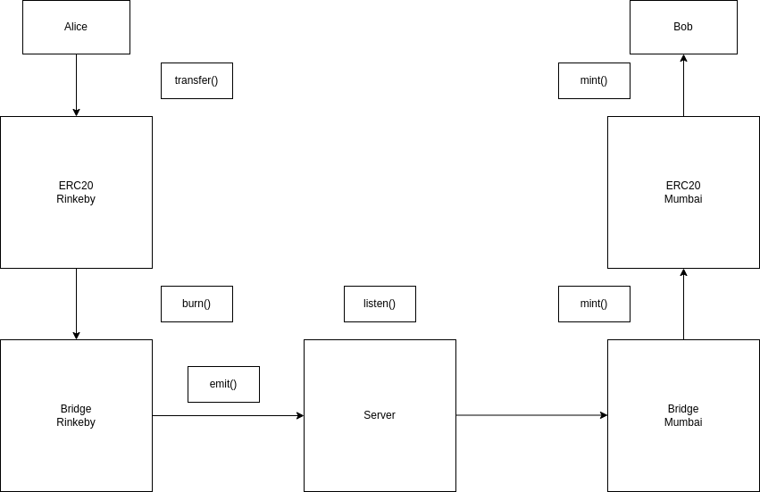

# Project

These projects demonstrate my skills in Solidity and a practical understading of how the web3 🌎 works.

This repo comprises of 2 web3 project, mainly a customised ERC721 and a token bridge between 2 different EVM compatible chains.

### Prerequisites

    1. Latest Node
    2. Latest NPM

## ERC-721

### Features

    1. `Pausable` : The owner of the smart contract can pause the minting functionality of the smart contract. When `paused`, no one can mint a new token.

    2. `Burnable` : The owner/approved-address of the token can `burn` the token. This will transfer the owner of the token back to `address(this)` , i.e, the smart contract itself where it can not be transfered ahead. The burned token will not be counted in the `total` minted token but will hold it's own state , i.e, `totalBurned`.

    3. `Whitelisted`: Only the users who have been `whitelisted` by the deployer of the smart contract can mint the tokens. The deployer needs to provide the `root` of the `merkel tree` of all the whitelisted users during deployment. When minting a token, the client should provide `proof` of the `leaf` that corresponds to the minter's address. If the `proof` is sufficient and results in the correct hash, user can mint the token.

    4. `Ownable` : The smart contract will set an `owner` when initialised. This `owner` can perform certain tasks such as `pausing` and `unpausing` the minting functionality.

### Run Tests

To run the tests, enter the following commands.

Optional: if packages are not installed.

```bash
    npm install
```

```bash
    npx hardhat test
```

## Token Bridge

This project tries to create a bridge between 2 EVM compatible chains, allowing users to send an ERC20 token from one chain to another. Intra-chain txs will happen as usual but inter-chain txs will require burning, minting and a server listening to the events. To make it tamper proof, I have added a signature feature as well that will protect it against a hacker who has hacked the intermediatory server and tries to send malicious requests.

### Example

Let's say Alice wants to send 20 AWS tokens from Rinkeby to Bob in Mumbai. The following are the steps that will happend in order to create a successfull transaction b/w these two.

    1. Alice needs to send 20 AWS tokens to a Bridge smart contract on the Rinkeby network. This smart contract will `burn` 20 tokens in the ERC20 smart contract, deducting 20 AWS from Alice's balance.
    2. This Bridge smart contract will `emit` an event with all the details of the txs.
    3. This event will be heard by a server who will listen to events from the Bridge smart contract.
    4. This server will then call the `mint` function on the Bridge smart contract on Mumbai which already has the ERC20 contract address of the AWS token on Mumbai.
    5. The `mint` function then calls the original AWS ERC20 contract interface and mints 20 tokens to Bob's address.

### Diagram


